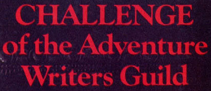
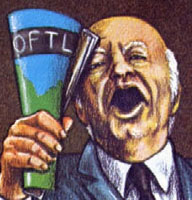
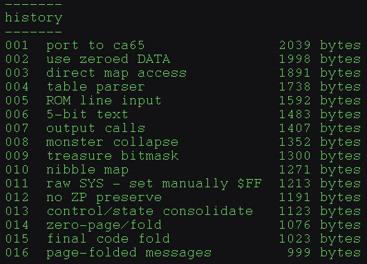
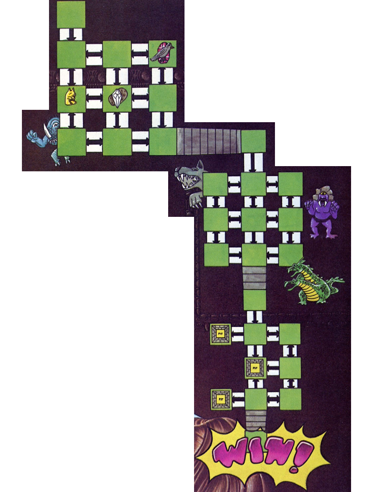

<!--
## Adventure of the Adventure Writers Adventure
-->
## 𝙰𝚍𝚟𝚎𝚗𝚝𝚞𝚛𝚎 𝚘𝚏 𝚝𝚑𝚎 𝙰𝚍𝚟𝚎𝚗𝚝𝚞𝚛𝚎 𝚆𝚛𝚒𝚝𝚎𝚛𝚜 𝙰𝚍𝚟𝚎𝚗𝚝𝚞𝚛𝚎

<!--
September 2026. At the peak of the Storage Wars there was a kilobyte shortage, and disk space was at a premium. Successive generations of annual sports-game releases had finally filled the world’s hard drives, leaving only a few unregulated loose sectors for civilian use.
My phone rang with the urgency of Red Alert on the Enterprise (because that was my ring tone). It was the Guild. The Text Adventure Writers Guild. TTAWG. T-TAWG. TAWGS. TAWGster.

"We have a situation. The text adventures... they're... gone"

"Wha..?"

"They're ALL gone, MP. Your assignment: Find Ken Rose's Adventure of the Adventure Writers Adventure. It's 43 lines of BASIC and runs on Apple II."

"Seems straight-forward enough."

"Not so fast, MP. AAWA is BLOATED. Massive. Storage-destroying. It's 2.5kb on disk and... I don't know if I should say this but... it needs a resident interpreter. An interpreter, MP! That's a hidden cost, and there are no kilobytes left in the world. We need an adventure game in BYTES."

"That's impossible", I commented.

"Comments? This is no time to worry about comments, MP! Compile them out!" cried T-TAWG.

No more text adventures. That wasn't good. But I knew someone who could help. I called up my old pal CA65.

"Hey CA... we got a job to do!"
-->


𝚂𝚎𝚙𝚝𝚎𝚖𝚋𝚎𝚛 2026. 𝙰𝚝 𝚝𝚑𝚎 𝚙𝚎𝚊𝚔 𝚘𝚏 𝚝𝚑𝚎 𝚂𝚝𝚘𝚛𝚊𝚐𝚎 𝚆𝚊𝚛𝚜 𝚝𝚑𝚎𝚛𝚎 𝚠𝚊𝚜 𝚊 𝚔𝚒𝚕𝚘𝚋𝚢𝚝𝚎 𝚜𝚑𝚘𝚛𝚝𝚊𝚐𝚎, 𝚊𝚗𝚍 𝚍𝚒𝚜𝚔 𝚜𝚙𝚊𝚌𝚎 𝚠𝚊𝚜 𝚊𝚝 𝚊 𝚙𝚛𝚎𝚖𝚒𝚞𝚖. 𝚂𝚞𝚌𝚌𝚎𝚜𝚜𝚒𝚟𝚎 𝚐𝚎𝚗𝚎𝚛𝚊𝚝𝚒𝚘𝚗𝚜 𝚘𝚏 𝚊𝚗𝚗𝚞𝚊𝚕 𝚜𝚙𝚘𝚛𝚝𝚜-𝚐𝚊𝚖𝚎 𝚛𝚎𝚕𝚎𝚊𝚜𝚎𝚜 𝚑𝚊𝚍 𝚏𝚒𝚗𝚊𝚕𝚕𝚢 𝚏𝚒𝚕𝚕𝚎𝚍 𝚝𝚑𝚎 𝚠𝚘𝚛𝚕𝚍’𝚜 𝚑𝚊𝚛𝚍 𝚍𝚛𝚒𝚟𝚎𝚜, 𝚕𝚎𝚊𝚟𝚒𝚗𝚐 𝚘𝚗𝚕𝚢 𝚊 𝚏𝚎𝚠 𝚞𝚗𝚛𝚎𝚐𝚞𝚕𝚊𝚝𝚎𝚍 𝚕𝚘𝚘𝚜𝚎 𝚜𝚎𝚌𝚝𝚘𝚛𝚜 𝚏𝚘𝚛 𝚌𝚒𝚟𝚒𝚕𝚒𝚊𝚗 𝚞𝚜𝚎.
𝙼𝚢 𝚙𝚑𝚘𝚗𝚎 𝚛𝚊𝚗𝚐 𝚠𝚒𝚝𝚑 𝚝𝚑𝚎 𝚞𝚛𝚐𝚎𝚗𝚌𝚢 𝚘𝚏 𝚁𝚎𝚍 𝙰𝚕𝚎𝚛𝚝 𝚘𝚗 𝚝𝚑𝚎 𝙴𝚗𝚝𝚎𝚛𝚙𝚛𝚒𝚜𝚎 (𝚋𝚎𝚌𝚊𝚞𝚜𝚎 𝚝𝚑𝚊𝚝 𝚠𝚊𝚜 𝚖𝚢 𝚛𝚒𝚗𝚐 𝚝𝚘𝚗𝚎). 𝙸𝚝 𝚠𝚊𝚜 𝚝𝚑𝚎 𝙶𝚞𝚒𝚕𝚍. 𝚃𝚑𝚎 𝚃𝚎𝚡𝚝 𝙰𝚍𝚟𝚎𝚗𝚝𝚞𝚛𝚎 𝚆𝚛𝚒𝚝𝚎𝚛𝚜 𝙶𝚞𝚒𝚕𝚍. 𝚃𝚃𝙰𝚆𝙶. 𝚃-𝚃𝙰𝚆𝙶. 𝚃𝙰𝚆𝙶𝚂. 𝚃𝙰𝚆𝙶𝚜𝚝𝚎𝚛.



"𝚆𝚎 𝚑𝚊𝚟𝚎 𝚊 𝚜𝚒𝚝𝚞𝚊𝚝𝚒𝚘𝚗. 𝚃𝚑𝚎 𝚝𝚎𝚡𝚝 𝚊𝚍𝚟𝚎𝚗𝚝𝚞𝚛𝚎𝚜... 𝚝𝚑𝚎𝚢'𝚛𝚎... 𝚐𝚘𝚗𝚎"

"𝚆𝚑𝚊..?"

"𝚃𝚑𝚎𝚢'𝚛𝚎 𝙰𝙻𝙻 𝚐𝚘𝚗𝚎, 𝙼𝙿. 𝚈𝚘𝚞𝚛 𝚊𝚜𝚜𝚒𝚐𝚗𝚖𝚎𝚗𝚝: 𝙵𝚒𝚗𝚍 𝙺𝚎𝚗 𝚁𝚘𝚜𝚎'𝚜 𝙰𝚍𝚟𝚎𝚗𝚝𝚞𝚛𝚎 𝚘𝚏 𝚝𝚑𝚎 𝙰𝚍𝚟𝚎𝚗𝚝𝚞𝚛𝚎 𝚆𝚛𝚒𝚝𝚎𝚛𝚜 𝙰𝚍𝚟𝚎𝚗𝚝𝚞𝚛𝚎. 𝙸𝚝'𝚜 43 𝚕𝚒𝚗𝚎𝚜 𝚘𝚏 𝙱𝙰𝚂𝙸𝙲 𝚊𝚗𝚍 𝚛𝚞𝚗𝚜 𝚘𝚗 𝙰𝚙𝚙𝚕𝚎 𝙸𝙸."

"𝚂𝚎𝚎𝚖𝚜 𝚜𝚝𝚛𝚊𝚒𝚐𝚑𝚝-𝚏𝚘𝚛𝚠𝚊𝚛𝚍 𝚎𝚗𝚘𝚞𝚐𝚑."

"𝙽𝚘𝚝 𝚜𝚘 𝚏𝚊𝚜𝚝, 𝙼𝙿. 𝙰𝙰𝚆𝙰 𝚒𝚜 𝙱𝙻𝙾𝙰𝚃𝙴𝙳. 𝙼𝚊𝚜𝚜𝚒𝚟𝚎. 𝚂𝚝𝚘𝚛𝚊𝚐𝚎-𝚍𝚎𝚜𝚝𝚛𝚘𝚢𝚒𝚗𝚐. 𝙸𝚝'𝚜 2.5𝚔𝚋 𝚘𝚗 𝚍𝚒𝚜𝚔 𝚊𝚗𝚍... 𝙸 𝚍𝚘𝚗'𝚝 𝚔𝚗𝚘𝚠 𝚒𝚏 𝙸 𝚜𝚑𝚘𝚞𝚕𝚍 𝚜𝚊𝚢 𝚝𝚑𝚒𝚜 𝚋𝚞𝚝... 𝚒𝚝 𝚗𝚎𝚎𝚍𝚜 𝚊 𝚛𝚎𝚜𝚒𝚍𝚎𝚗𝚝 𝚒𝚗𝚝𝚎𝚛𝚙𝚛𝚎𝚝𝚎𝚛. 𝙰𝚗 𝚒𝚗𝚝𝚎𝚛𝚙𝚛𝚎𝚝𝚎𝚛, 𝙼𝙿! 𝚃𝚑𝚊𝚝'𝚜 𝚊 𝚑𝚒𝚍𝚍𝚎𝚗 𝚌𝚘𝚜𝚝, 𝚊𝚗𝚍 𝚝𝚑𝚎𝚛𝚎 𝚊𝚛𝚎 𝚗𝚘 𝚔𝚒𝚕𝚘𝚋𝚢𝚝𝚎𝚜 𝚕𝚎𝚏𝚝 𝚒𝚗 𝚝𝚑𝚎 𝚠𝚘𝚛𝚕𝚍. 𝚆𝚎 𝚗𝚎𝚎𝚍 𝚊𝚗 𝚊𝚍𝚟𝚎𝚗𝚝𝚞𝚛𝚎 𝚐𝚊𝚖𝚎 𝚒𝚗 𝙱𝚈𝚃𝙴𝚂."

"𝚃𝚑𝚊𝚝'𝚜 𝚒𝚖𝚙𝚘𝚜𝚜𝚒𝚋𝚕𝚎", 𝙸 𝚌𝚘𝚖𝚖𝚎𝚗𝚝𝚎𝚍.

"𝙲𝚘𝚖𝚖𝚎𝚗𝚝𝚜? 𝚃𝚑𝚒𝚜 𝚒𝚜 𝚗𝚘 𝚝𝚒𝚖𝚎 𝚝𝚘 𝚠𝚘𝚛𝚛𝚢 𝚊𝚋𝚘𝚞𝚝 𝚌𝚘𝚖𝚖𝚎𝚗𝚝𝚜, 𝙼𝙿! 𝙲𝚘𝚖𝚙𝚒𝚕𝚎 𝚝𝚑𝚎𝚖 𝚘𝚞𝚝!" 𝚌𝚛𝚒𝚎𝚍 𝚃-𝚃𝙰𝚆𝙶.

𝙽𝚘 𝚖𝚘𝚛𝚎 𝚝𝚎𝚡𝚝 𝚊𝚍𝚟𝚎𝚗𝚝𝚞𝚛𝚎𝚜. 𝚃𝚑𝚊𝚝 𝚠𝚊𝚜𝚗'𝚝 𝚐𝚘𝚘𝚍. 𝙱𝚞𝚝 𝙸 𝚔𝚗𝚎𝚠 𝚜𝚘𝚖𝚎𝚘𝚗𝚎 𝚠𝚑𝚘 𝚌𝚘𝚞𝚕𝚍 𝚑𝚎𝚕𝚙. 𝙸 𝚌𝚊𝚕𝚕𝚎𝚍 𝚞𝚙 𝚖𝚢 𝚘𝚕𝚍 𝚙𝚊𝚕 𝙲𝙰65.

"𝙷𝚎𝚢 𝙲𝙰... 𝚠𝚎 𝚐𝚘𝚝 𝚊 𝚓𝚘𝚋 𝚝𝚘 𝚍𝚘!"

<!--
### Written in CA65 and Worked Down to 999 Bytes
-->
### 𝚁𝚎𝚠𝚛𝚒𝚝𝚝𝚎𝚗 𝚒𝚗 𝙲𝙰65 𝚊𝚗𝚍 𝚆𝚘𝚛𝚔𝚎𝚍 𝙳𝚘𝚠𝚗 𝚝𝚘 999 𝙱𝚢𝚝𝚎𝚜
<!--
Full code history of the work-down is provided for those interested. Beginning with a working CA65 example in 2039 bytes, we golf our way down to 999 bytes and satisfy the demands of The Guild.
-->
𝙵𝚞𝚕𝚕 𝚌𝚘𝚍𝚎 𝚑𝚒𝚜𝚝𝚘𝚛𝚢 𝚘𝚏 𝚝𝚑𝚎 𝚠𝚘𝚛𝚔-𝚍𝚘𝚠𝚗 𝚒𝚜 𝚙𝚛𝚘𝚟𝚒𝚍𝚎𝚍 𝚏𝚘𝚛 𝚝𝚑𝚘𝚜𝚎 𝚒𝚗𝚝𝚎𝚛𝚎𝚜𝚝𝚎𝚍. 𝙱𝚎𝚐𝚒𝚗𝚗𝚒𝚗𝚐 𝚠𝚒𝚝𝚑 𝚊 𝚠𝚘𝚛𝚔𝚒𝚗𝚐 𝙲𝙰65 𝚎𝚡𝚊𝚖𝚙𝚕𝚎 𝚒𝚗 2039 𝚋𝚢𝚝𝚎𝚜, 𝚠𝚎 𝚐𝚘𝚕𝚏 𝚘𝚞𝚛 𝚠𝚊𝚢 𝚍𝚘𝚠𝚗 𝚝𝚘 999 𝚋𝚢𝚝𝚎𝚜 𝚊𝚗𝚍 𝚜𝚊𝚝𝚒𝚜𝚏𝚢 𝚝𝚑𝚎 𝚍𝚎𝚖𝚊𝚗𝚍𝚜 𝚘𝚏 𝚃𝚑𝚎 𝙶𝚞𝚒𝚕𝚍.


    
<!--
### Ken's Original Listing
-->
### 𝙺𝚎𝚗'𝚜 𝙾𝚛𝚒𝚐𝚒𝚗𝚊𝚕 𝙻𝚒𝚜𝚝𝚒𝚗𝚐
```
1 R = 1: FOR A = 1 TO 10: READ N(A),S(A),E(A),W(A): NEXT : IF L = 2 THEN GOSUB 24
2 X = 0:V1$ = "": PRINT : PRINT "QUICK!!! WHICH WAY SHOULD I GO? ": PRINT : INPUT "";A$
3 FOR A = 1 TO LEN (A$): IF MID$ (A$,A,1) = " " THEN X = A - 1:A = 0:V1$ = RIGHT$ (A$, LEN (A$) - (X + 1)):X = 0: GOTO 5
4 NEXT A:V1$ = RIGHT$ (A$, LEN (A$) - (X - 1)):X = 0
5 IF V1$ = "NORTH" OR V1$ = "N" OR V1$ = "SOUTH" OR V1$ = "S" OR V1$ = "EAST" OR V1$ = "E" OR V1$ = "WEST" OR V1$ = "W" THEN GOTO 7
6 PRINT : PRINT "I ONLY KNOW HOW TO GO NORTH, SOUTH, EAST, OR WEST...HURRY AND TRY AGAIN.": GOTO 2
7 GOSUB 13: IF L = 1 THEN L = 2: GOTO 1
8 IF L = 0 THEN GOSUB 20
9 IF L = 2 THEN GOSUB 24: GOSUB 31
10 IF L = 3 THEN GOSUB 24: PRINT : PRINT "WATCH OUT FOR THE PITS...": GOSUB 38
11 IF L = 4 THEN GOSUB 24: GOTO 42
12 GOTO 2
13 X = R: IF V1$ = "NORTH" OR V1$ = "N" THEN R = N(R)
14 IF V1$ = "SOUTH" OR V1$ = "S" THEN R = S(R)
15 IF V1$ = "EAST" OR V1$ = "E" THEN R = E(R)
16 IF V1$ = "WEST" OR V1$ = "W" THEN R = W(R)
17 IF R = 11 THEN L = L + 1:R = 1: PRINT : PRINT "WHOOPS, WE'RE ON ANOTHER LEVEL."
18 IF R > 0 THEN Q = 0:M = 0: RETURN
19 PRINT : PRINT "UH, UH...CAN'T MOVE THAT WAY.":R = X:X = 0:M = M + 1: RETURN
20 IF R = 5 THEN T1 = 1
21 IF R = 6 THEN T2 = 1
22 IF R = 4 THEN T3 = 1
23 IF R = 8 THEN T4 = 1
24 PRINT : PRINT "YOU'RE CARRYING:": PRINT
25 IF T1 = 0 AND T2 = 0 AND T3 = 0 AND T4 = 0 THEN PRINT "NOTHING": GOTO 30
26 IF T1 = 1 THEN PRINT "A STATUE OF A GOLDEN MUSKRAT"
27 IF T2 = 1 THEN PRINT "A DIAMOND THE SIZE OF A POTATO"
28 IF T3 = 1 THEN PRINT "A PIGEON THE SIZE OF A RUBY"
29 IF T4 = 1 THEN PRINT "A TANTALUS"
30 RETURN
31 IF R = 3 THEN B$ = "WEREWOLVES":Q = 1
32 IF R = 7 THEN B$ = "THREE-TOED OGRES":Q = 1
33 IF R = 9 THEN B$ = "HORRIBLE DRAGONS":Q = 1
34 IF Q = 0 THEN RETURN
35 IF M > 1 THEN GOTO 37
36 IF Q = 1 THEN PRINT : PRINT "HURRY, RUN....": PRINT B$;" ARE AFTER YOU!!!!":M = M + 1: RETURN
37 PRINT : PRINT "TSK TSK. THE ";B$;" GOTCHA.": GOTO 41
38 IF R = 3 OR R = 4 OR R = 8 THEN PRINT : PRINT "YIKES...YOU'RE FALLING, FALLING, FALLING, FALLING...FALLING...OOPS!!!": PRINT : GOTO 41
39 RETURN
40 DATA 0,2,0,0,0,5,3,0,0,6,4,2,0,7,0,3,2,8,6,0,3,9,7,5,4,10,0,6,5,0,9,0,6,0,10,8,0,0,11,0,0,2,0,0,0,4,5,3,0,6,2,0,2,10,7,6,0,7,0,2,3,8,2,0,5,9,0,4,6,0,10,0,7,0,0,10,4,11,9,8
41 PRINT : PRINT "AW, YOU'RE DEAD.": END
42 IF T1 = 1 AND T2 = 1 AND T3 = 1 AND T4 = 1 THEN PRINT : PRINT "HEY, YOU WON...CONGRATULATIONS!!!": END
43 PRINT : PRINT "WELL, PAL, YOU GOT OUT BUT WITHOUT ALL THE TREASURES...YOU LOSE.": END
```
<!--
## Oh, you may want this...
-->
### 𝙾𝚑, 𝚢𝚘𝚞 𝚖𝚊𝚢 𝚠𝚊𝚗𝚝 𝚝𝚑𝚒𝚜...


